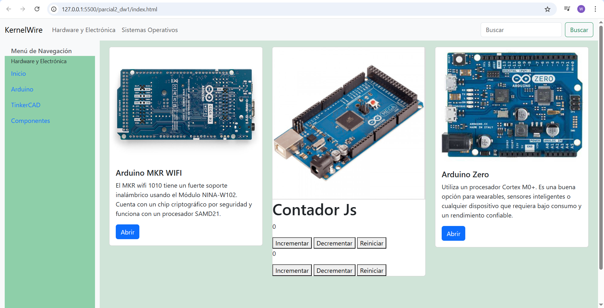

# parcial2_dw1

## Fecha: 11/07/2025

## Estudiante: Walter Antonio Machaca Anze

La práctica consiste en un sitio web utilizando elementos de bootstrap y componentes dinámicos personalizados con JavaScript inmersos en cards de Bootstrap.

## Captura Interfaz página:

